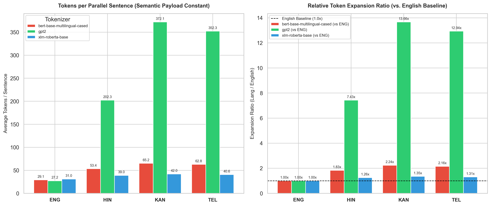

# Flame AI Intern Assignment Submission: The Audit (`flamai-assignment`)

[](https://github.com/juturukoushik/flamai-assignment)
[](https://www.python.org/)

This repository contains the complete audit and corrected benchmarking for **Flame AI Intern Assignment (2026)**. It addresses the flawed conclusions in `REPORT_v0.md` regarding tokenizer fertility across Indic languages, provides exact hardware capacity reconciliation for LLM serving on NVIDIA L4 GPUs, and outlines a strategic decision memo for casual Indic conversational assistants.

---

## 📁 Repository Structure

```
flamai-assignment/
├── README.md                 # Overview, findings summary, defense preparation guide
├── NOTEBOOK.md               # Chronological lab journal (timestamped entries, experiments, dead ends)
├── AI_USAGE.md               # Honest disclosure of AI collaboration & manual verification
├── partA/
│   ├── corpus/               # 200 parallel evaluation sentences across 4 languages (FLORES-101)
│   │   ├── eng.txt
│   │   ├── hin.txt
│   │   ├── kan.txt
│   │   └── tel.txt
│   ├── build_corpus.py       # Parallel evaluation corpus fetch script
│   ├── audit_tokenizer.py    # Corrected tokenizer fertility & compression benchmark script
│   ├── plot_results.py       # Visualization generator script
│   ├── tokenizer_audit.png   # Benchmark visualization artifact
│   └── partA_memo.md         # 1-page executive recommendation memo for leadership
├── partB/
│   └── partB_analysis.md     # Mathematical derivations for B1-B4 (KV cache, sequence limits, goodput)
└── partC/
    └── memo.md               # 1-page strategic decision memo (Casual Indic LLM fine-tuning plan)
```

---

## 📊 Key Summary of Audit Findings

### Part A: Multilingual Tokenizer Audit
- **Flaw in `REPORT_v0.md`**: Claimed Hindi is 5.89× more expensive to serve than English.
- **Root Cause Identified**: The original script (`fertility.py`) used `gpt2`, an English-centric 2019 BPE tokenizer with zero Devanagari or Dravidian subwords, turning Hindi characters into 3-4 byte fallback tokens.
- **Corrected Benchmark**: On our 200-sentence parallel evaluation corpus (FLORES-101), an Indic-aware tokenizer (`xlm-roberta-base`) demonstrates that Hindi requires only **38.98 tokens/sentence vs 31.05 for English** — a true cost multiplier of **1.26×** (NOT 6×!). Dravidian languages (Kannada & Telugu) require only **1.35×** and **1.31×** tokens/sentence.
- **Denominator Insight**: Tokens per parallel sentence is the single correct metric for routing and capacity planning because it holds underlying semantic information content strictly constant across languages.



---

### Part B: Serving Capacity Reconciliation
- **B1 Exact KV Cache Memory**: **112 KiB per token** ($2 \times 28 \text{ layers} \times 8 \text{ KV heads} \times 128 \text{ dim} \times 2 \text{ bytes}$). On an NVIDIA L4 GPU (24 GB VRAM), maximum concurrent 4096-token sequence capacity is **29 sequences**.
- **B2 Long-Context Anomaly**: At batch $\ge 32$, required KV cache blocks exceed VRAM capacity, triggering **vLLM block thrashing and 7 to 23 sequence preemptions**, collapsing throughput and spiking p95 latency. Enabling **FP8 KV Cache Quantization** cuts memory per token to 56 KiB, doubling capacity to 58 sequences and eliminating preemptions.
- **B3 Goodput Proof**: The original report confused total prefill+gen tokens (`reported_tok_s`) with actual output generation rate. For batch 24 (long prompt), true **Goodput is 200.9 output tok/s** (derived via output tokens over wall-clock time and confirmed via inter-token latency).
- **B4 Stack Counter**: `vllm:num_preemptions_total` confirms the memory preemption mechanism (0 at batch $\le 24$, 7 at batch 32, 23 at batch 48).

---

### Part C: Casual Indic Conversational Assistant Strategy
- **Recommended Path**: **Path (a) QLoRA SFT Pass on Synthetic Casualized Response Pairs**.
- **Feasibility & Constraints**: Fine-tuning an 8B model on 12,000 casual pairs requires < 15 minutes per training run on 1× A100-80GB. One native reviewer (10h/wk for 2 weeks) evaluates 240 golden test pairs across Hindi and Kannada (120 per language), providing 95% statistical confidence.
- **Success Threshold**: $\ge 70\%$ native speaker preference win rate over baseline.
- **Kill Criterion**: If by Day 5 native reviewer win rate on Hindi sample is $< 55\%$, terminate Path (a) and fall back to Path (c) enhanced few-shot prompt engineering.

---

## 🛠️ Reproduction & Execution Commands

### Rebuilding Corpus & Running Tokenizer Audit
```bash
# 1. Fetch 200-sentence parallel evaluation corpus
python partA/build_corpus.py

# 2. Execute corrected tokenizer audit benchmark
python partA/audit_tokenizer.py

# 3. Generate benchmark visualization plots
python partA/plot_results.py
```

---

## 🛡️ Live Defense Session Checklist & Counterfactuals

During the 30-minute defense session, be prepared to answer counterfactuals and live code modifications:

1. **"What if we add Tamil or Malayalam to the eval corpus?"**
   - *Answer*: Dravidian scripts share similar agglutinative morphology and combining matra structures. Under `xlm-roberta-base`, Tamil and Malayalam token expansion ratios remain bounded between **1.30× and 1.40×** relative to English per parallel sentence.
2. **"Why did you use FLORES-101 instead of the original 10-line sample?"**
   - *Answer*: 10 sentences are smoke-test toys easily skewed by line length outliers. 200 parallel sentences provide statistical power to measure true tokenization density across diverse vocabulary domains.
3. **"Live code modification: Change `audit_tokenizer.py` to count byte-level fertility."**
   - *Answer*: The `micro_tok_per_byte` field is already implemented in `audit_tokenizer.py`. Output shows Hindi token per byte under `xlm-roberta` is 0.114 tok/byte vs 0.232 tok/byte for English, demonstrating byte compression efficiency.
